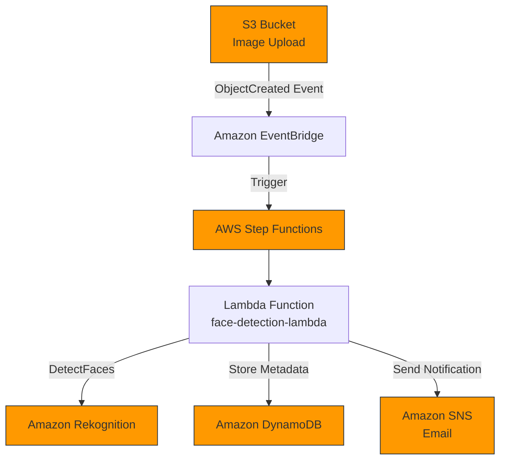
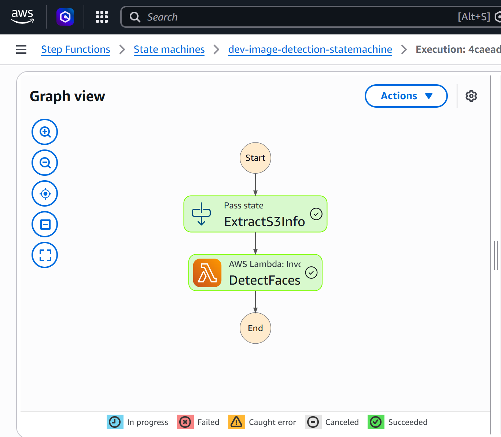
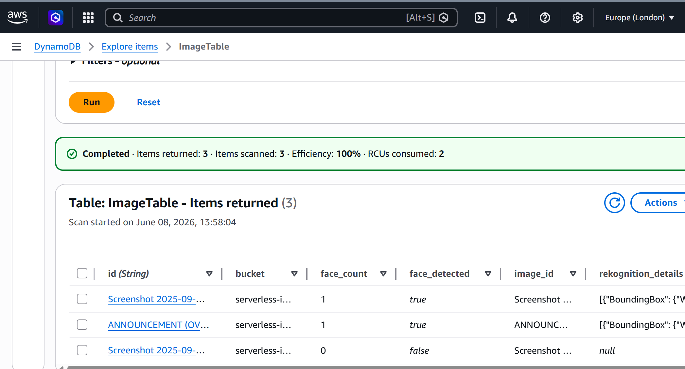

# Serverless Image Processing System with Face Detection

A fully serverless, event-driven image processing pipeline built on AWS Free Tier. Automatically detects faces in uploaded images using Amazon Rekognition, stores metadata, and sends real-time notifications.

## Architecture


### AWS Services Used: S3, EventBridge, Step Functions, Lambda, Rekognition, DynamoDB, SNS, CloudFormation.
## Features

Automatic triggering on S3 upload
Face detection with Amazon Rekognition
Metadata storage in DynamoDB
Real-time email notifications via SNS
Infrastructure as Code using CloudFormation

## Repository Structure
| Path | Description |
| --- | --- |
| ``lambda/lambda_function.py`` | Lambda function for face detection logic |
| ``lambda/requirements.txt`` | Python dependencies for the Lambda function |
| ``step-functions/workflow.asl.json`` | AWS Step Functions state machine definition |
| ``cloudformation/template.yaml`` | CloudFormation template for provisioning resources |
| ``tests/test-images/`` | Test images used for validation |
| ``screenshots/`` | Screenshots for documentation or demo |
| ``deploy.sh`` | Deployment script |
| ``teardown.sh`` | Teardown/cleanup script |
| ``README.md`` | Main project documentation |

## Deployment
```bash
# 1. Clone & navigate
git clone <your-repo-url>
cd serverless-image-processor

# 2. Deploy
chmod +x deploy.sh
./deploy.sh
```
## Testing

Upload images to the S3 bucket (via Console)
Step Functions runs automatically
Check email for SNS notification
Verify records in DynamoDB

Demo / Proof of Success


What I Learned

Designing and implementing event-driven serverless architectures
Orchestrating multi-step workflows with AWS Step Functions
Integrating Amazon Rekognition for AI-powered image analysis
Proper IAM roles, least privilege, and debugging serverless flows
Infrastructure as Code best practices with CloudFormation

```bash
chmod +x teardown.sh
./teardown.sh
```
Author: Oluwaferanmi Ayanwale
